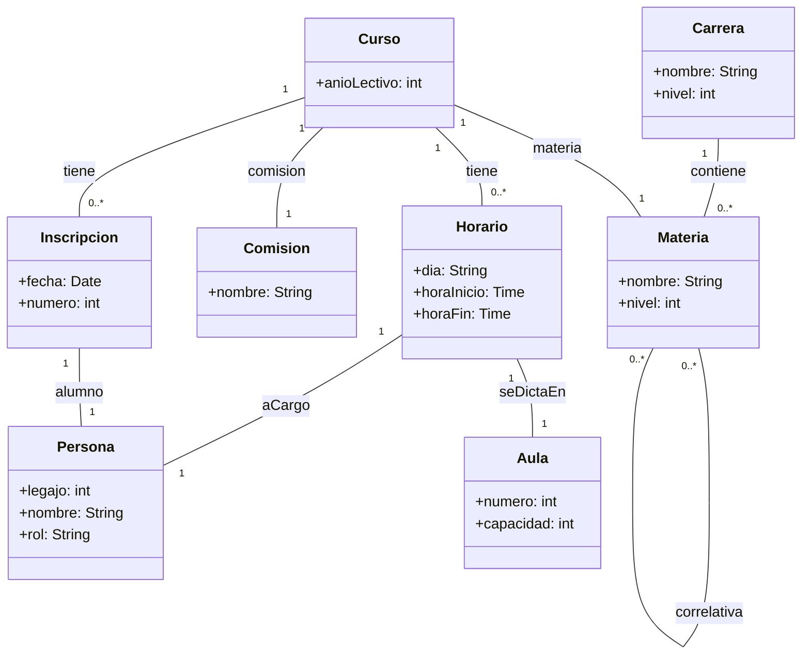

```mermaid
classDiagram
class Carrera {
  +nombre: String
  +nivel: int
}

class Materia {
  +nombre: String
  +nivel: int
}

class Persona {
  +legajo: int
  +nombre: String
  +rol: String
}

class Aula {
  +numero: int
  +capacidad: int
}

class Comision {
  +nombre: String
}

class Curso {
  +anioLectivo: int
}

class Horario {
  +dia: String
  +horaInicio: Time
  +horaFin: Time
}

class Inscripcion {
  +fecha: Date
  +numero: int
}

Carrera "1" -- "0..*" Materia : contiene
Materia "0..*" -- "0..*" Materia : correlativa

Curso "1" -- "1" Materia : materia
Curso "1" -- "1" Comision : comision
Curso "1" -- "0..*" Inscripcion : tiene
Curso "1" -- "0..*" Horario : tiene

Horario "1" -- "1" Aula : seDictaEn
Horario "1" -- "1" Persona : aCargo

Inscripcion "1" -- "1" Persona : alumno
```
