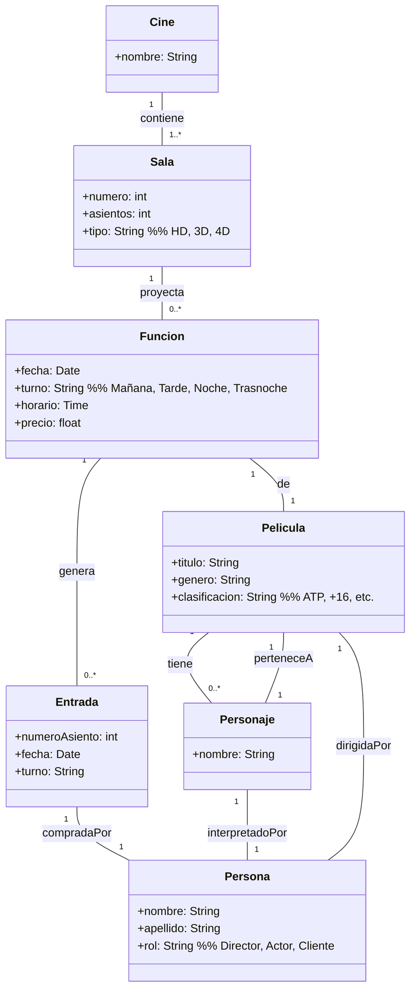

```mermaid
classDiagram
class Cine {
  +nombre: String
}

class Sala {
  +numero: int
  +asientos: int
  +tipo: String  %% HD, 3D, 4D
}

class Pelicula {
  +titulo: String
  +genero: String
  +clasificacion: String %% ATP, +16, etc.
}

class Funcion {
  +fecha: Date
  +turno: String %% Mañana, Tarde, Noche, Trasnoche
  +horario: Time
  +precio: float
}

class Entrada {
  +numeroAsiento: int
  +fecha: Date
  +turno: String
}

class Persona {
  +nombre: String
  +apellido: String
  +rol: String %% Director, Actor, Cliente
}

class Personaje {
  +nombre: String
}

Cine "1" -- "1..*" Sala : contiene
Sala "1" -- "0..*" Funcion : proyecta
Funcion "1" -- "1" Pelicula : de
Funcion "1" -- "0..*" Entrada : genera

Entrada "1" -- "1" Persona : compradaPor
Personaje "1" -- "1" Persona : interpretadoPor
Personaje "1" -- "1" Pelicula : perteneceA

Pelicula "1" -- "1" Persona : dirigidaPor
Pelicula "1" -- "0..*" Personaje : tiene
```
