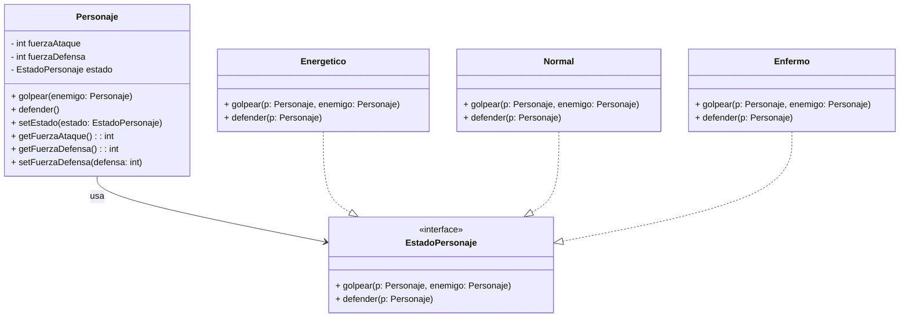

```mermaid
classDiagram
    class Personaje {
        - int fuerzaAtaque
        - int fuerzaDefensa
        - EstadoPersonaje estado
        + golpear(enemigo: Personaje)
        + defender()
        + setEstado(estado: EstadoPersonaje)
        + getFuerzaAtaque(): int
        + getFuerzaDefensa(): int
        + setFuerzaDefensa(defensa: int)
    }

    class EstadoPersonaje {
        <<interface>>
        + golpear(p: Personaje, enemigo: Personaje)
        + defender(p: Personaje)
    }

    class Energetico {
        + golpear(p: Personaje, enemigo: Personaje)
        + defender(p: Personaje)
    }

    class Normal {
        + golpear(p: Personaje, enemigo: Personaje)
        + defender(p: Personaje)
    }

    class Enfermo {
        + golpear(p: Personaje, enemigo: Personaje)
        + defender(p: Personaje)
    }

    Personaje --> EstadoPersonaje : usa
    Energetico ..|> EstadoPersonaje
    Normal ..|> EstadoPersonaje
    Enfermo ..|> EstadoPersonaje
```
